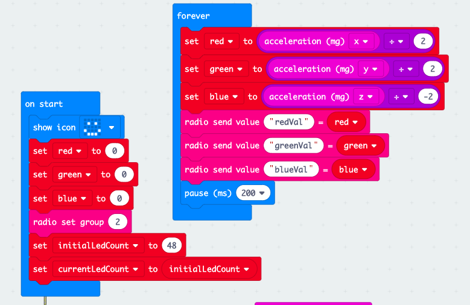
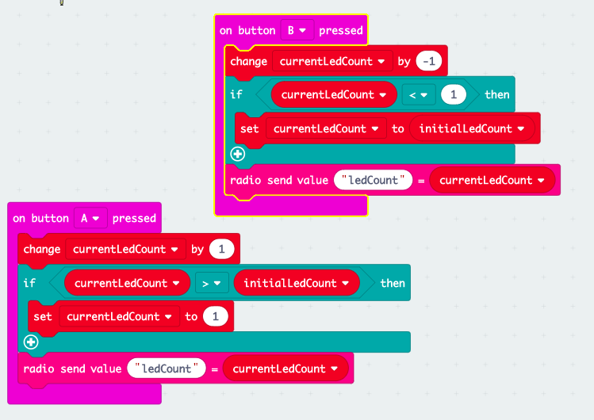
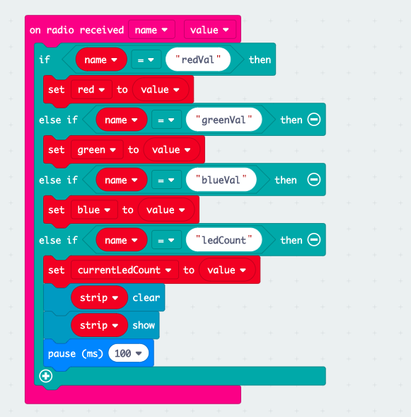
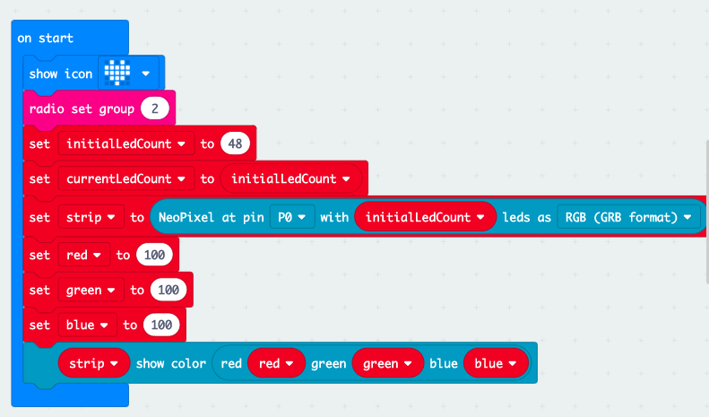
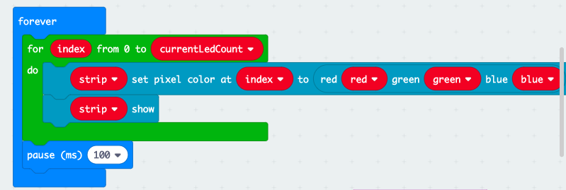
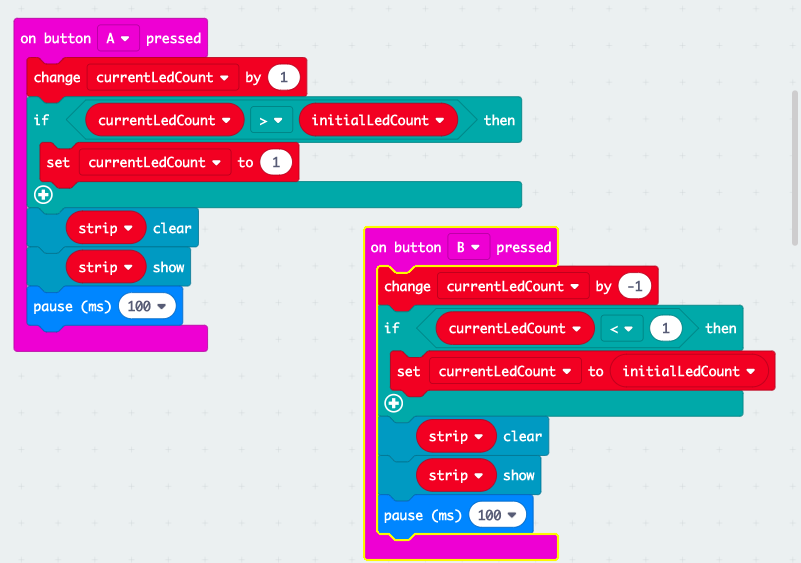

# Microbit controlled ledStrip

Demossa ohjataan microbitin avulla RGB-led-nauhaa

## Kytkentä

Microbit --> RGB-lednauha

D0 --> Din eli data in

3V --> +5V lednauhan käyttöjännite

GND --> 0V tai GND

## Lähetin

Lähetin microbit lukee kiihtyvyysanturin x,y,z- arvot asteikolta 0 ...1023 ja muuntaa ne lednauhan RGB -arvoiksi välille 0 ...255. Napeista A ja B voi muuttaa lednauhan ledien lukumäärää. Tämän jälkeen arvot lähetetään vastaanotin microbitille.

## Vastaanotin
Vastaanotin lukee radioviestinä saapuneita RGB-arvoja ja aktiivisten ledien lukumäärän ja kirjoittaa arvot lednauhaan.

## License
[MIT](https://choosealicense.com/licenses/mit/)
