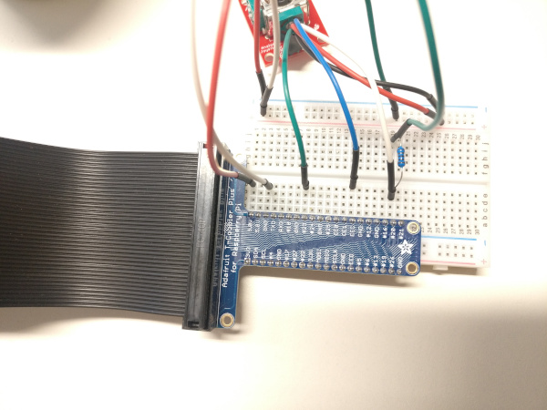
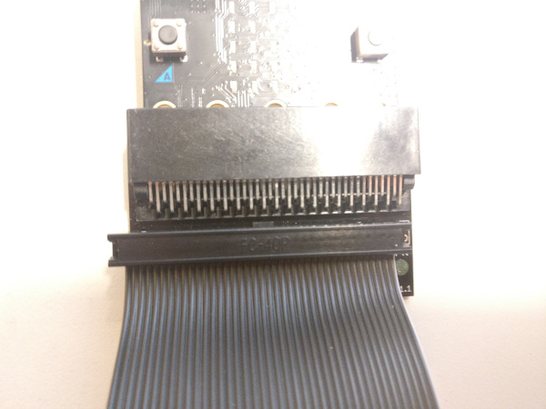
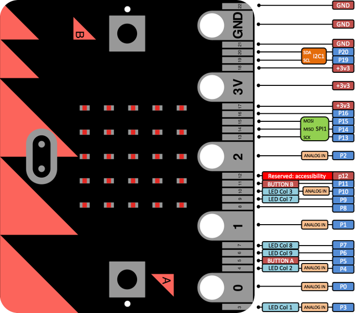

# Gamepad
Raspberry Pi osuuden löydät [täältä](https://github.com/Pohjois-Tapiolan-lukio/raspberry_pi-projects/tree/master/projects/gamepad)

## Yhteenveto
Tässä projektissa opetetaan Microbitin ja Linux-laitteen välisen
_sarjaliikenne_kommunikoinnin perusteet.

Tämä kansio sisältää vain Microbittiin liittyvät ohjeet.

## Tarvittavat osat
- Microbit & USB-johto
- Jotain seuraavista:
    - Nappeja
    - Joystickeja
- 1KΩ vastuksia
> (vaatii lisätutkimusta: liian suuri pulldown-vastus tuottaa ongelmia
> `read_digital`-metodin kanssa)
- Hyppylankoja jne.
> Voit hyödyntää Raspberryn 40-pinnistä T-Cobbleria, jos haluat
> käyttää kytkentäalustaa.

> Tarvitset myös 40-pinnisen kaapelin


## Ohjeet

### Napit ja joystickit
Lue napeista ja joystickeista [<i>täältä</i>](https://github.com/Pohjois-Tapiolan-lukio/arduino-projects/tree/master/gamepad#ohjeet)

### Microbitin ohjelmointi MicroPythonilla
> Ohjelman rakenne on sama kuin Arduinolla

> Pinnien diagrammi


---
Määritellään napin ja joystickin syötteiden pinnit
```python
NAPPI = pin[napin pinnin numero]

# Joystickin akselien pinnien pitaa olla analogisia syotteita (ANALOG IN)
JOYSTICK_X = pin[joystickin horisontaalisen akselin pinnin numero]
JOYSTICK_Y = pin[vertikaalisen akselin pinnin numero]
JOYSTICK_THUMB = pin[joystickin napin pinnin numero]
```
> pin[numero] on olio luokasta `MicroBitDigitalPin`,
> `MicroBitAnalogDigitalPin` tai `MicroBitTouchPin`
> jossa numero on välillä 0 – 20 mutta ei ole 17 tai 18
>
> Lisää infoa saa täältä <http://microbit-micropython.readthedocs.io/en/latest/pin.html#pin-functions>

Syötteitä voi lukea metodilla `read_digital` tai `read_analog`
```python
nappi = NAPPI.read_digital()
joyX = JOYSTICK_X.read_analog()
```

#### Sarjaliikenteeseen kirjoittaminen
Oletusarvoltaan sarjaliikenne on konfiguroitu `115200` symbolinopeudelle
> [Sarjaliikenteenlukijan](https://github.com/Pohjois-Tapiolan-lukio/raspberry_pi-projects/tree/master/projects/gamepad#python-sarjaliikennekuuntelija)
> pitää myös kuunnella samalla symbolinopeudella (baudrate)!

Sarjaliikenteeseen kirjoittaminen tapahtuu `print`-komennolla
```
print("Viesti")
```

Sarjaliikenteeseen halutaan kirjoittaa jatkuvasti, joten käytetään
`while`-silmukkaa

```python
while True:
    # lue data
    # koodaa data
    # tulosta koodattu data
    # nuku hetki
```
> Nukkuminen on hyvin oleellinen osa silmukkaa, että
> sarjaliikenteen lukija pysyy mukana

#### Datan koodaus
Sarjaliikenteessä kulkevalla datalla pitää olla formaatii eli koodi

Formaatti voi olla esimerkiksi:
- `[luku1],[luku2],[luku3]`, eli luvut peräkkäin pilkulla erotettuna
> Tämä on yksinkertaisin toimiva ratkaisu
- `luku1:[luku1],luku2:[luku2],luku2:[luku2]`, eli avain-arvo
pareja pilkulla erotettuna
> Tämän etuna on se, että ihmisen on helpompi lukea dataa
- `[luku1hex{N}][luku2hex{N}][luku3hex{N}]`, eli luvut muutettuina
heksadesimaaliin ja padättyinä nollilla merkkijonojen maksimipituuteen *N*
> esim luvut 123, 4095, 515, N=3 -> 07BFFF203 <br/>
> Tämän *informaatiotiheys* on suurempi
>
> **Haastetta haluaville suosittelen keksimään jonkun oman formaatin**

---
Koodaus toteutetaan MicroPythonissa `str.format`-funktiolla

Yllä olevat esimerkkiformaatit voidaan toteuttaa seuraavasti:
> `[luku1],[luku2],[luku3]`, eli luvut peräkkäin pilkulla erotettuna

```python
print("{},{},{}".format(luku1, luku2, luku3))
```
> `luku1:[luku1],luku2:[luku2],luku2:[luku2]`, eli avain-arvo
> pareja pilkulla erotettuna

```python
print("luku1:{},luku2:{},luku3:{}".format(luku1, luku2, luku3))
```
> `[luku1hex{N}][luku2hex{N}][luku3hex{N}]`, eli luvut muutettuina
> heksadesimaaliin ja täytettyinä nollilla lukujen maksimipituuteen `N` asti

```python
print("{:03X}{:03X}{:03X}".format(luku1,luku2,luku3))
```
> Vertaa ratkaisun pituutta [Arduinon ratkaisuun](https://github.com/Pohjois-Tapiolan-lukio/arduino-projects/blob/master/gamepad/README.md#koodi)

#### Valmis ohjelma
Kun kaikki osat ovat valmiita, ne voidaan yhdistää
valmiiksi ohjelmaksi

While-silmukan koodi voi esimerkiksi näyttää tältä
```python
while True:
    # luetaan data
    nappi = NAPPI.read_digital()
    joystick_x = JOYSTICK_X.read_analog()
    joystick_y = JOYSTICK_X.read_analog()
    joystick_thumb = JOYSTICK_THUMB.read_digital()

    # koodataan data
    data = "{},{},{},{}".format(nappi, joystick_x, joystick_y, joystick_thumb)

    # tulostetaan data
    print(data)

    # nukutaan hetki
    sleep(15) #ms
```

Valmis esimerkkitiedoston kommentteineen löytyy [täältä](gamepad.py)
